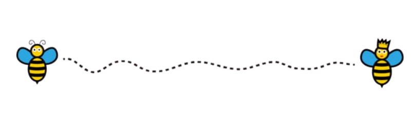

 +Hello+World!+I'm+Nusrat+Jahan+Chaiti" />
  

  

  

<h2 align="left">
   About me
</h2>

I’m a Computer Science and Engineering student at **East West University**, majoring in **Software Engineering**, with a strong knowledge in software development, problem-solving, and modern programming practices.

### Currently Learning

- Web Programming  
- Artificial Intelligence  
- Software Architecture  
- International Relations

 

<h2 align="left">
   Social & Contact
</h2>

  

<h2 align="left">
   Tech Stack
</h2>

###  Programming & Web

###  Frontend & UI

###  Backend, DevOps & Tools

 

## Documentation & Writing

  

## 📊 GitHub Stats:

    

> ✎ *Top Languages reflects public repository usage only — not skill level.*

<h2 align="left">
   Watch my contribution graph get devoured by a hungry snake!
</h2>

<picture> <source media="(prefers-color-scheme: dark)" srcset="https://raw.githubusercontent.com/nusratjahanchaiti/nusratjahanchaiti/output/github-snake-dark.svg" /> <source media="(prefers-color-scheme: light)" srcset="https://raw.githubusercontent.com/nusratjahanchaiti/nusratjahanchaiti/output/github-snake.svg" />  </picture>
